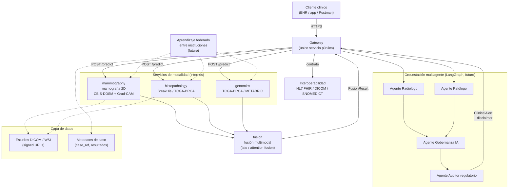

# Arquitectura — Visión general

## 1. Visión

`mama-detector` es un **copiloto clínico multimodal y multiagente** para apoyar la detección
temprana de cáncer de mama en el **contexto colombiano**. No es un dispositivo médico
certificado: complementa el criterio del profesional de salud, no lo reemplaza (ver
[`phi-and-security.md`](phi-and-security.md)).

El sistema combina, a nivel de diseño, tres modalidades de entrada clínica (mamografía 2D,
histopatología, genómica), un servicio de fusión multimodal, y una capa de orquestación
multiagente (Radiólogo, Patólogo, Gobernanza IA, Auditor regulatorio) inspirada en la disciplina
PSP/PMBOK del equipo y en las tendencias de la industria (Clairity Breast, guías NCCN 2026,
Mammo-FM).

El alcance real del Trabajo de Grado (ver
[`../anteproyecto/propuesta-alcance-tg.md`](../anteproyecto/propuesta-alcance-tg.md)) distingue
entre **arquitectura completa diseñada** y una **rebanada vertical implementada y validada**:
mamografía 2D sobre CBIS-DDSM + Grad-CAM + orquestación multiagente con LangGraph + endpoint
interoperable DICOM/FHIR/SNOMED + métricas clínicas. El resto (foundation models propios,
aprendizaje federado, histopatología/genómica reales, Kubernetes/DGX, Spark, Edge AI) queda
documentado como trabajo futuro por restricciones de hardware y presupuesto de un TG.

## 2. Arquitectura completa diseñada

Gateway público único que orquesta las 3 modalidades y el servicio de fusión; agentes clínicos
sobre el resultado fusionado; interoperabilidad con sistemas de información hospitalaria; capa de
datos por modalidad; evolución futura hacia aprendizaje federado entre instituciones.

Notas de diseño:

- El **gateway** es la única superficie pública; los servicios de modalidad y fusión viven en red
  interna.
- Los **4 agentes** (Radiólogo, Patólogo, Gobernanza IA, Auditor regulatorio) son el equivalente
  funcional del sistema multiagente exigido por el profesor; hoy corresponden 1:1 a los 4
  subagentes read-only de `.claude/agents/` que auditan el código, y a futuro se implementarán
  como grafo LangGraph que interviene en el flujo de análisis clínico real (ADR-0005).
- **Interoperabilidad**: el gateway expone/consume el resultado clínico bajo un contrato alineado
  con HL7 FHIR y SNOMED CT, y acepta estudios en DICOM en la modalidad de mamografía.
- **Datos**: los estudios (DICOM/WSI) y los resultados de predicción son PHI; solo se referencian
  vía `case_ref` y signed URLs (ver [`phi-and-security.md`](phi-and-security.md)).
- **Federado** es explícitamente trabajo futuro: entrenamiento colaborativo entre instituciones sin
  centralizar datos de pacientes.

## 3. Lo implementado hoy

El andamiaje actual (`services/*` + `packages/contracts`) es un **mock funcional**, no modelos
entrenados:

- `gateway` (`services/gateway/app/main.py`) expone `POST /cases/{case_ref}/analyze`: llama en
  paralelo (`asyncio.gather`) a `mammography`, `histopathology` y `genomics` en `POST /predict`,
  arma un `FusionRequest` con los 3 `ModalityResult`, lo envía a `fusion` (`POST /fuse`) y devuelve
  un `ClinicalAlert` con `level` (`low|medium|high`, umbralado sobre el score fusionado) y el
  `FusionResult`.
- `mammography`, `histopathology`, `genomics` (`services/<modalidad>/app/main.py`) exponen cada
  uno `POST /predict`: reciben un `PredictRequest{case_ref}`, corren un `preprocessing.preprocess`
  + `model.predict` stub, y devuelven un `ModalityResult{modality, prediction}`.
- `fusion` (`services/fusion/app/strategy.py`) implementa la estrategia mock: promedio simple de
  los `score` de las 3 modalidades, `label = "malignant"` si el promedio ≥ 0.5, y devuelve las
  `contributions` por modalidad.
- Los 5 servicios comparten los contratos generados de `packages/contracts` (ver
  [`contracts.md`](contracts.md)) y se orquestan localmente con `docker-compose`
  (`infra/docker-compose.yml`) vía `just up`.
- **Tests:** 9/9 pasan en verde en los 5 servicios (`uv run pytest -q` por servicio; ver
  [`../runbook.md`](../runbook.md)) — 2 por cada servicio de modalidad y fusión (`test_health` +
  contrato/predicción), 1 en gateway (`test_analyze_orchestrates_modalities_and_fusion`). CI
  (`.github/workflows/backend.yml`) corre esta misma matriz de tests más la verificación de que
  los contratos generados no tienen diff contra el schema fuente.

## 4. Mapeo diseño ↔ implementado ↔ trabajo futuro

| Componente | Diseño completo | Estado hoy | Trabajo futuro |
|---|---|---|---|
| Gateway público | Único punto de entrada, orquesta modalidades + fusión + agentes | **Implementado (mock)**: orquesta 3 modalidades + fusión vía HTTP | Integrar agentes LangGraph en el flujo real |
| Mamografía 2D | Transfer learning sobre CBIS-DDSM + Grad-CAM | **Implementado (mock)**: `predict` stub, contrato válido | Entrenar modelo real + Grad-CAM (RF-002, RF-003) |
| Histopatología | Correlación con BreakHis / TCGA-BRCA | **Implementado (mock)**: contrato válido, sin modelo | Dataset + modelo real (RF-006) |
| Genómica | Integración TCGA-BRCA / METABRIC | **Implementado (mock)**: contrato válido, sin modelo | Fuera de alcance del TG (presupuesto/hardware) |
| Fusión multimodal | Late / attention fusion | **Implementado (mock)**: promedio simple | Fusión aprendida (RF-005) |
| Agentes (Radiólogo/Patólogo/Gobernanza/Auditor) | Grafo LangGraph interviniendo en el análisis clínico | **Implementado parcial**: existen como subagentes de revisión de código en `.claude/agents/` | Orquestación LangGraph real sobre el caso clínico (ADR-0005, RF-004) |
| Interoperabilidad FHIR/DICOM/SNOMED | Endpoint clínico estándar | Propuesto | Endpoint FHIR + validación DICOM (RF-001, RF-007) |
| Explicabilidad (XAI) | Grad-CAM / mapas de atención en toda alerta de riesgo | Propuesto | RF-003 |
| Aprendizaje federado | Entrenamiento colaborativo entre instituciones | No iniciado | Fuera de alcance del TG |
| Contratos compartidos | JSON Schema → pydantic generado | **Implementado** | — |
| Tests automatizados | Cobertura de contrato por servicio | **Implementado**: 9/9 en verde | Ampliar cobertura al crecer la lógica real |

## 5. Enlaces

- [`contracts.md`](contracts.md) — contratos compartidos (`packages/contracts`).
- [`phi-and-security.md`](phi-and-security.md) — PHI, logging, marco legal CO, ética.
- [`../requisitos.md`](../requisitos.md) — catálogo RF/RNF y su estado real.
- [`../runbook.md`](../runbook.md) — cómo correr el sistema en local.
- [`../deployment/railway.md`](../deployment/railway.md) — borrador de despliegue.
- [`../anteproyecto/propuesta-alcance-tg.md`](../anteproyecto/propuesta-alcance-tg.md) — alcance
  acordado con el profesor.
