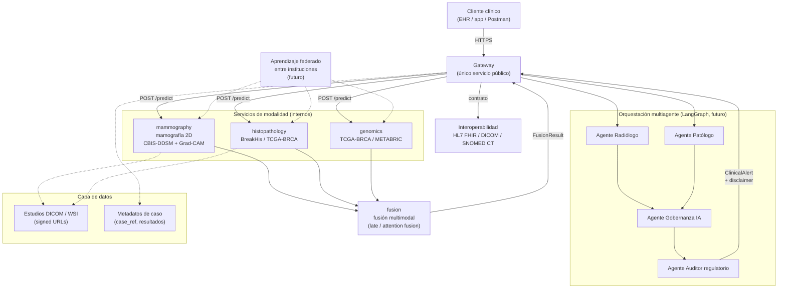

# Arquitectura — Visión general

## 1. Visión

`mama-detector` es un **copiloto clínico multimodal y multiagente** para apoyar la detección
temprana de cáncer de mama en el **contexto colombiano**. No es un dispositivo médico
certificado: complementa el criterio del profesional de salud, no lo reemplaza (ver
[`phi-and-security.md`](phi-and-security.md)).

El sistema combina, a nivel de diseño, tres modalidades de entrada clínica (mamografía 2D,
histopatología, genómica), un servicio de fusión multimodal, y una capa de orquestación
multiagente (Radiólogo, Patólogo, Gobernanza IA, Auditor regulatorio) inspirada en la disciplina
PSP/PMBOK del equipo y en las tendencias de la industria (Clairity Breast, guías NCCN 2026,
Mammo-FM).

El alcance real del Trabajo de Grado (ver
[`../anteproyecto/propuesta-alcance-tg.md`](../anteproyecto/propuesta-alcance-tg.md)) distingue
entre **arquitectura completa diseñada** y una **rebanada vertical implementada y validada**:
mamografía 2D sobre CBIS-DDSM + Grad-CAM + orquestación multiagente con LangGraph + endpoint
interoperable DICOM/FHIR/SNOMED + métricas clínicas. El resto (foundation models propios,
aprendizaje federado, histopatología/genómica reales, Kubernetes/DGX, Spark, Edge AI) queda
documentado como trabajo futuro por restricciones de hardware y presupuesto de un TG.

## 2. Arquitectura completa diseñada

Gateway público único que orquesta las 3 modalidades y el servicio de fusión; agentes clínicos
sobre el resultado fusionado; interoperabilidad con sistemas de información hospitalaria; capa de
datos por modalidad; evolución futura hacia aprendizaje federado entre instituciones.

Notas de diseño:

- El **gateway** es la única superficie pública; los servicios de modalidad y fusión viven en red
  interna.
- Los **4 agentes** (Radiólogo, Patólogo, Gobernanza IA, Auditor regulatorio) son el sistema
  multiagente del **producto** que exige el profesor: correrán **en runtime, en la nube, como grafo
  LangGraph** que interviene en el flujo de análisis clínico real (ADR-0005). Hoy **no están
  implementados** (RF-004, trabajo futuro). No confundir con los subagentes de `.claude/agents/`,
  que llevan los mismos nombres pero son **herramientas de desarrollo** (revisan el repositorio,
  no forman parte de la plataforma).
- **Interoperabilidad**: el gateway expone/consume el resultado clínico bajo un contrato alineado
  con HL7 FHIR y SNOMED CT, y acepta estudios en DICOM en la modalidad de mamografía.
- **Datos**: los estudios (DICOM/WSI) y los resultados de predicción son PHI; solo se referencian
  vía `case_ref` y signed URLs (ver [`phi-and-security.md`](phi-and-security.md)).
- **Federado** es explícitamente trabajo futuro: entrenamiento colaborativo entre instituciones sin
  centralizar datos de pacientes.

## 3. Lo implementado hoy

El andamiaje actual (`services/*` + `packages/contracts`) es un **mock funcional**, no modelos
entrenados:

- `gateway` (`services/gateway/app/main.py`) expone `POST /analyze` con cuerpo `AnalyzeRequest`
  (`{case_ref}`): el `case_ref` (PHI) viaja en el cuerpo, **no en la URL**. Llama en paralelo
  (`asyncio.gather`) a `mammography`, `histopathology` y `genomics` en `POST /predict`, arma un
  `FusionRequest` con los 3 `ModalityResult`, lo envía a `fusion` (`POST /fuse`) y devuelve un
  `ClinicalAlert` con un `analysis_id` **opaco generado server-side** (no correlacionable con
  `case_ref`), el `level` (`low|medium|high`, umbralado sobre el score fusionado) y el
  `FusionResult`. El `case_ref` **no aparece** en la respuesta ni en logs (RNF-001).
- `mammography`, `histopathology`, `genomics` (`services/<modalidad>/app/main.py`) exponen cada
  uno `POST /predict`: reciben un `PredictRequest{case_ref}`, corren un `preprocessing.preprocess`
  + `model.predict` stub, y devuelven un `ModalityResult{modality, prediction}`.
- `fusion` (`services/fusion/app/strategy.py`) implementa la estrategia mock: promedio simple de
  los `score` de las 3 modalidades, `label = "malignant"` si el promedio **supera** 0.5
  (`avg > 0.5`, umbral estricto), y devuelve las `contributions` por modalidad. Este umbral es un
  **placeholder no clínico**: se eligió `> 0.5` para que un promedio de exactamente 0.5 sea
  `benign` y no contradiga los stubs de modalidad, que devuelven `score=0.1, label="benign"`
  (ver B-013). Cuando exista un modelo real, el umbral se calibrará con datos de validación.
- Los 5 servicios comparten los contratos generados de `packages/contracts` (ver
  [`contracts.md`](contracts.md)) y se orquestan localmente con `docker-compose`
  (`infra/docker-compose.yml`) vía `just up`.
- **Tests:** 12 pruebas en total — 9 en los 5 servicios (corren en `just test` y CI) + 3 en `packages/contracts` 
  (aún no wireadas en CI/`just test`). Los 9 de servicios pasan en verde: 2 por cada servicio de modalidad y fusión 
  (`test_health` + contrato/predicción), 1 en gateway (`test_analyze_orchestrates_modalities_and_fusion`). CI
  (`.github/workflows/backend.yml`) corre esta matriz de 9 tests más la verificación de que
  los contratos generados no tienen diff contra el schema fuente.

## 4. Mapeo diseño ↔ implementado ↔ trabajo futuro

| Componente | Diseño completo | Estado hoy | Trabajo futuro |
|---|---|---|---|
| Gateway público | Único punto de entrada, orquesta modalidades + fusión + agentes | **Implementado (mock)**: orquesta 3 modalidades + fusión vía HTTP | Integrar agentes LangGraph en el flujo real |
| Mamografía 2D | Transfer learning sobre CBIS-DDSM + Grad-CAM | **Implementado (mock)**: `predict` stub, contrato válido | Entrenar modelo real + Grad-CAM (RF-002, RF-003) |
| Histopatología | Correlación con BreakHis / TCGA-BRCA | **Implementado (mock)**: contrato válido, sin modelo | Dataset + modelo real (RF-006) |
| Genómica | Integración TCGA-BRCA / METABRIC | **Implementado (mock)**: contrato válido, sin modelo | Fuera de alcance del TG (presupuesto/hardware) |
| Fusión multimodal | Late / attention fusion | **Implementado (mock)**: promedio simple | Fusión aprendida (RF-005) |
| Agentes (Radiólogo/Patólogo/Gobernanza/Auditor) | Grafo LangGraph interviniendo en el análisis clínico | **Implementado parcial**: existen como subagentes de revisión de código en `.claude/agents/` | Orquestación LangGraph real sobre el caso clínico (ADR-0005, RF-004) |
| Interoperabilidad FHIR/DICOM/SNOMED | Endpoint clínico estándar | Propuesto | Endpoint FHIR + validación DICOM (RF-001, RF-007) |
| Explicabilidad (XAI) | Grad-CAM / mapas de atención en toda alerta de riesgo | Propuesto | RF-003 |
| Aprendizaje federado | Entrenamiento colaborativo entre instituciones | No iniciado | Fuera de alcance del TG |
| Contratos compartidos | JSON Schema → pydantic generado | **Implementado** | — |
| Estadificación TNM (AJCC 8) | Motor **determinista dirigido por tabla**, sin ML: recibe datos clínicos estructurados y calcula el grupo pronóstico | **Propuesto**: decidido (ADR-0006), sin código ni schema | Motor + cobertura exhaustiva de la tabla de verdad (RF-009, #6) |
| Estimación de `cT` desde imagen | Diámetro mayor en mm + incertidumbre, requiere `PixelSpacing` | **Propuesto** | Segmentación de lesión + lectura DICOM (RF-010, #7) |
| Tests automatizados | Cobertura de contrato por servicio | **Implementado**: 18/18 en verde (contratos 4 · fusion 3 · gateway 2 · genomics 3 · histopathology 3 · mammography 3), verificado el 2026-07-15 | Ampliar cobertura al crecer la lógica real |

### 4.1 Dónde encaja el motor de estadificación (y dónde **no**)

El motor de estadificación (RF-009) es **una función desacoplada**, no un paso más del pipeline de
mamografía. La distinción es clínica, no de diseño:

> **El motor se dispara sobre un cáncer confirmado por biopsia, nunca sobre la salida del modelo.**
> La plataforma detecta **sospecha**; estadificar porque el modelo dijo `malignant` sería
> precisamente el error a evitar. **No existe función BI-RADS → estadio**: BI-RADS gradúa la
> sospecha de un estudio de imagen, TNM describe la extensión anatómica de un cáncer **ya
> diagnosticado**.

Consecuencias para el mapa de arriba:

- **El motor no cuelga del gateway de análisis.** No recibe una `Prediction` ni un `FusionResult`:
  recibe `cT`/`cN`/`cM`, grado Nottingham, RE, RP, HER2 y el **contexto de tratamiento**, todos como
  **dato estructurado** de origen clínico. Los **recibe**; no los infiere ni los mide.
- **No depende de RF-006** (histopatología). El estadio pronóstico no necesita un modelo que infiera
  biomarcadores: necesita **un campo en el contrato**. Confundir *inferir* con *recibir* es el error
  de fondo que esta separación evita.
- **No tiene AUC.** Al ser determinista, se verifica por **cobertura exhaustiva de la tabla de
  verdad**, no por métrica estadística. No se valida contra CBIS-DDSM, que **no tiene etiquetas
  TNM**.
- **La única pieza que sí toca el pipeline** es la estimación de `cT` (RF-010), que sale marcada
  como estimación radiológica con prefijo `c` — nunca `pT`. `cN` y `cM` **no son inferibles** desde
  una mamografía, y sin `N` ni `M` **no hay estadio**.
- **Sube el perfil regulatorio:** emitir un estadio es afirmación clínica de mayor riesgo que un
  triaje (RNF-006 INVIMA, RNF-007 OMS).

Detalle clínico en [`../clinical/tnm.md`](../clinical/tnm.md); decisión en
[`../adr/0006-estadificacion-tnm-ajcc8-pronostica.md`](../adr/0006-estadificacion-tnm-ajcc8-pronostica.md).

## 5. Enlaces

- [`contracts.md`](contracts.md) — contratos compartidos (`packages/contracts`).
- [`phi-and-security.md`](phi-and-security.md) — PHI, logging, marco legal CO, ética.
- [`../clinical/tnm.md`](../clinical/tnm.md) — estadificación TNM (AJCC 8): qué es inferible desde
  imagen y qué no.
- [`../requisitos.md`](../requisitos.md) — catálogo RF/RNF y su estado real.
- [`../runbook.md`](../runbook.md) — cómo correr el sistema en local.
- [`../deployment/railway.md`](../deployment/railway.md) — borrador de despliegue.
- [`../anteproyecto/propuesta-alcance-tg.md`](../anteproyecto/propuesta-alcance-tg.md) — alcance
  acordado con el profesor.
